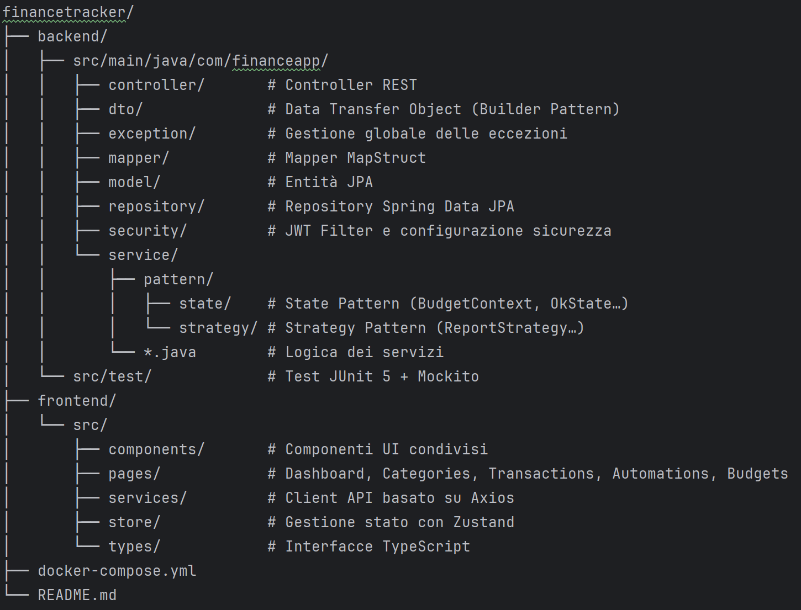

# FinanceTracker

Applicazione web Personal Finance Tracker pronta per l’uso in produzione, sviluppata con Spring Boot e React.

Permette di gestire entrate, spese, categorie e budget personali con dashboard e report finanziari.

# Architettura
Livello	Tecnologia
Backend	Java 21 · Spring Boot 3 · Spring Security · JWT
Frontend	React 18 · Vite · TypeScript · Tailwind CSS · Recharts
Database	PostgreSQL 16
ORM	Spring Data JPA · Hibernate
Mapper	MapStruct
Containerizzazione	Docker · Docker Compose

# Design Patterns utilizzati
Strategy Pattern – Report finanziari

L’interfaccia ReportStrategy viene implementata da:

MonthlyReportStrategy – aggregazione del flusso di cassa giornaliero

CategoryReportStrategy – suddivisione delle spese per categoria

ReportContext seleziona dinamicamente la strategia appropriata a runtime.

Questo approccio segue il principio Open/Closed, permettendo di aggiungere nuovi tipi di report senza modificare il codice esistente.

State Pattern – Stato del Budget

BudgetContext gestisce la transizione tra diversi stati del budget:

OkState – meno dell’80% del budget utilizzato

WarningState – tra l’80% e il 100%

ExceededState – oltre il 100%

Ogni stato incapsula la propria logica di:

colore

badge

etichetta

Seguendo il principio Single Responsibility.

Builder Pattern – Dashboard DTO

DashboardOverviewDto.Builder costruisce la risposta complessa della dashboard tramite una fluent API leggibile.

La risposta include:

KPI finanziari

transazioni recenti

stato dei budget

dati per i grafici

# Avvio rapido (Docker)
Clonare il repository
git clone https://github.com/yourusername/financetracker.git
cd financetracker

# Avviare tutti i servizi
docker-compose up --build
Servizio	URL
Frontend	http://localhost:3000

Backend API	http://localhost:8080

Swagger UI	http://localhost:8080/swagger-ui.html

PostgreSQL	localhost:5432
🛠️ Sviluppo locale
Backend
cd backend

# Richiede PostgreSQL attivo localmente
# oppure usare Docker solo per il database
docker-compose up postgres -d

mvn spring-boot:run
Frontend
cd frontend

npm install
npm run dev

Applicazione disponibile su:

http://localhost:5173
# Struttura del progetto

Per eseguire i test del backend:

cd backend
mvn test

I test coprono:

JwtServiceTest – generazione e validazione dei token JWT

BudgetStateTest – transizioni dello State Pattern (OK → WARNING → EXCEEDED)

ReportStrategyTest – aggregazione dei report mensili e per categoria