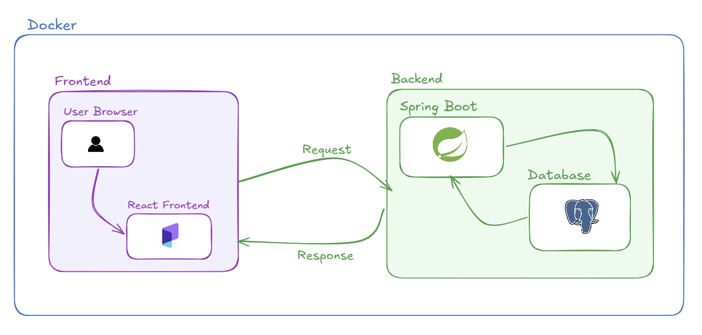

# FinanceTracker

Un'applicazione web completa per la gestione delle finanze personali, con tracciamento di entrate e uscite, gestione budget e report dettagliati.

## Panoramica

FinanceTracker è una piattaforma moderna per la gestione del risparmio personale. L'applicazione permette agli utenti di monitorare i propri flussi di cassa, categorizzare le transazioni, impostare budget mensili e visualizzare l'andamento finanziario tramite grafici interattivi. 

Include un sistema di **seeding automatico** delle categorie standard e offre una completa **gestione del profilo utente** per garantire sicurezza e privacy. È progettata per essere robusta, sicura e pronta per l'uso in produzione.



## Architettura

L'applicazione segue un'architettura client-server moderna, garantendo separazione delle responsabilità e manutenibilità:

### Frontend
- **Web App**: Applicazione Single Page sviluppata con React 18 e Vite.
  - UI moderna e reattiva con Tailwind CSS.
  - Grafici dinamici realizzati con Recharts.
  - TypeScript per una gestione sicura dei tipi.

### Backend
- **Core Service**: API RESTful sviluppata con Spring Boot 3.
  - Sicurezza gestita con Spring Security e JWT.
  - Persistenza dati tramite Spring Data JPA e Hibernate.
  - Mapping degli oggetti con MapStruct per un'architettura pulita.

## Stack Tecnologico

### Frontend
- **Framework**: React 18
- **Build Tool**: Vite
- **Language**: TypeScript
- **Styling**: Tailwind CSS
- **Charts**: Recharts

### Backend
- **Framework**: Spring Boot 3.4
- **Language**: Java 21
- **Security**: Spring Security + JWT
- **ORM**: Hibernate
- **Database Mapping**: MapStruct

### Database & Storage
- **PostgreSQL 16**: Database relazionale per la persistenza dei dati.
- **Docker**: Containerizzazione dei servizi per una distribuzione facilitata.

## Design Patterns

L'applicazione implementa diversi pattern architetturali per garantire flessibilità e manutenibilità:

- **Strategy Pattern**: Utilizzato per la generazione dei report finanziari. `ReportContext` seleziona dinamicamente tra `MonthlyReportStrategy` (flusso di cassa giornaliero) e `CategoryReportStrategy` (suddivisione spese per categoria), facilitando l'aggiunta di nuovi tipi di report.
- **State Pattern**: Gestisce lo stato del budget (`OkState`, `WarningState`, `ExceededState`). Ogni stato incapsula la propria logica di visualizzazione (badge, colori) e comportamento, seguendo il principio di singola responsabilità.
- **Builder Pattern**: Utilizzato in `DashboardOverviewDto` per costruire risposte complesse in modo leggibile e fluido, aggregando KPI, transazioni recenti e dati per i grafici.

## Funzionalità Principali

### Per gli Utenti
- Registrazione e login sicuro (JWT)
- Tracciamento di entrate e spese in tempo reale
- Gestione categorie personalizzate e **seeding automatico in Italiano**
- **Sezione Profilo**: Gestione username, email e cambio password sicuro
- Dashboard riepilogativa con grafici interattivi e report mensili
- Monitoraggio del budget con avvisi automatici
- **Eliminazione Account**: Possibilità di rimuovere permanentemente l'utente e i dati associati

## Installazione e Setup

### Prerequisiti
- Java 21 SDK
- Node.js 18+
- Docker & Docker Compose
- Maven (per build backend)

### 1. Clone Repository
```bash
git clone https://github.com/MatteoFagnani/FinanceTracker.git
cd FinanceTracker
```

### 2. Setup Rapido con Docker
```bash
docker-compose up --build
```
L'applicazione sarà disponibile al seguente indirizzo:
- **Frontend**: http://localhost:3000

### 3. Sviluppo Locale

#### Backend
```bash
cd backend
# Avviare PostgreSQL via Docker
docker-compose up postgres -d
# Run applicazione
mvn spring-boot:run
```

#### Frontend
```bash
cd frontend
npm install
npm run dev
```
Disponibile su: http://localhost:5173

## Struttura del Progetto

```text
FinanceTracker/
├── backend/                        # Server Spring Boot
│   ├── src/main/java/              # Codice sorgente Java
│   │   └── com/financeapp/
│   │       ├── config/             # Configurazioni (Security, CORS, etc.)
│   │       ├── controller/         # Endpoint REST API
│   │       ├── dto/                # Data Transfer Objects
│   │       ├── exception/          # Gestione errori personalizzata
│   │       ├── mapper/             # Mapping Model <-> DTO (MapStruct)
│   │       ├── model/              # Entità del Database (JPA)
│   │       ├── repository/         # Interfacce per il Database (Spring Data JPA)
│   │       ├── security/           # Logica JWT e Filtri di Sicurezza
│   │       ├── service/            # Logica di Business
│   │       └── FinanceTrackerApplication.java
│   ├── Dockerfile                  # Configurazione Docker backend
│   └── pom.xml                     # Gestione dipendenze e build Maven
├── frontend/                       # Client React + Vite
│   ├── src/                        # Codice sorgente React
│   │   ├── assets/                 # Immagini, font, file statici
│   │   ├── components/             # UI Components riutilizzabili
│   │   ├── context/                # Context API per lo stato globale
│   │   ├── hooks/                  # Custom React Hooks
│   │   ├── pages/                  # Viste principali (Dashboard, Login, etc.)
│   │   ├── services/               # Chiamate API (Axios)
│   │   ├── store/                  # Gestione stato (se presente/Zustand/Redux)
│   │   ├── styles/                 # File CSS/Tailwind aggiuntivi
│   │   ├── types/                  # Definizioni TypeScript
│   │   └── utils/                  # Funzioni di utilità
│   │   ├── App.tsx                 # Componente radice
│   │   └── main.tsx                # Punto di ingresso React
│   ├── public/                     # Asset pubblici (index.html, icone)
│   ├── Dockerfile                  # Configurazione Docker frontend
│   └── package.json                # Dipendenze e script Node.js
├── docker-compose.yml              # Orchestrazione container Docker
├── README.md                       # Questa documentazione
```


## Sicurezza

- Autenticazione basata su JSON Web Token (JWT)
- Role-based access control (RBAC) con Spring Security
- Password hashing sicuro (BCrypt) e **cambio password con verifica vecchia password**
- **Cancellazione sicura dell'account** con eliminazione a cascata di tutti i dati associati
- Gestione sicura delle sessioni stateless

## Testing

I test coprono le parti critiche del sistema:
```bash
cd backend
mvn test
```
**Aree coperte:**
- `JwtServiceTest`: Generazione e validazione dei token.
- `BudgetStateTest`: Transizioni di stato del budget.
- `ReportStrategyTest`: Logica di aggregazione dei report.

## Licenza

Questo progetto è sotto licenza MIT.

## Autore

**Matteo Fagnani** - [GitHub Profile](https://github.com/MatteoFagnani)
